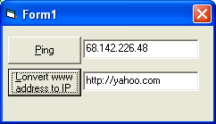



## A true ping with Visual Basic in a convenient class containing 2 methods and 1 property

### Description

This is a class that allows a true ping with visual basic. It is organized in an intuituve, easy to use, class that contains 2 methods [funcConvertStringAddressToIp] (self explanitory) [PingHost] which has one argument [szAddress] which may be provided in either an ip format (xxx.xxx.xxx.xxx) OR in string formats ("www.address.com") or ("http://www.address.com") OR ("http://address.com") and one property [timeOutVal] (self explanitory)
 
### More Info
 

             |
---                |---
**Submitted On**   |2006-02-13 21:42:46
**By**             |[dan aprobee](https://github.com/Planet-Source-Code/PSCIndex/blob/master/ByAuthor/dan-aprobee.md)
**Level**          |Intermediate
**User Rating**    |5.0 (10 globes from 2 users)
**Compatibility**  |VB 5\.0, VB 6\.0
**Category**       |[Custom Controls/ Forms/  Menus](https://github.com/Planet-Source-Code/PSCIndex/blob/master/ByCategory/custom-controls-forms-menus__1-4.md)
**World**          |[Visual Basic](https://github.com/Planet-Source-Code/PSCIndex/blob/master/ByWorld/visual-basic.md)
**Archive File**   |[A\_true\_pin1973012132006\.zip](https://github.com/Planet-Source-Code/dan-aprobee-a-true-ping-with-visual-basic-in-a-convenient-class-containing-2-methods-and-1__1-64321/archive/master.zip)

